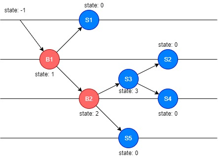
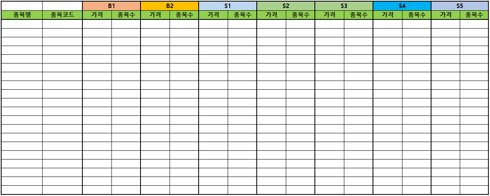
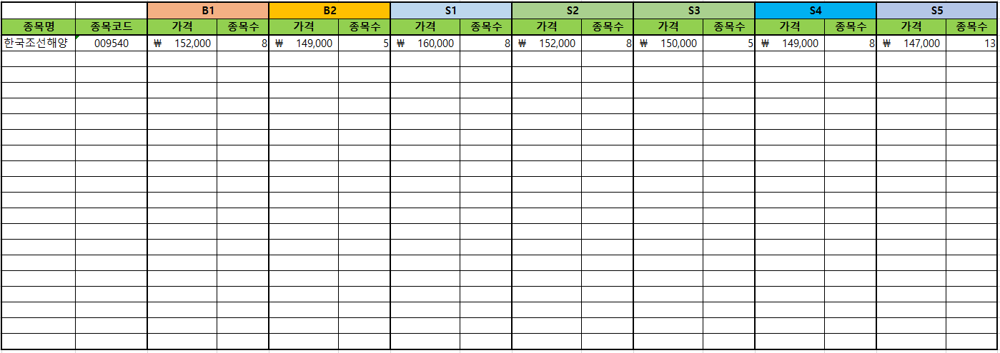
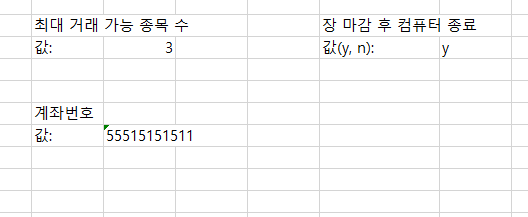

# Kiwoom-ATS
Auto Trading System using Kiwoom Open API

## 개요
키움 Open API+ 를 사용하여 타점 기반 자동거래를 제공하는 프로그램입니다.

## 매매 패턴

### 매수 매도 타점
 * 빨강: 매수 타점
 * 파랑: 매도 타점

### 타점 별 설명
각 타점은 B(Buy)와 S(Sell)로 구분됩니다.
B1, B2는 매수타점이고 S1, S2, S3, S4, S5는 매도타점입니다.

### 다양한 매매패턴
 * <strong>B1매수 -> S1매도</strong> (가장 좋음. 무조건 수익)
 * <strong>B1매수 -> B2매수 -> S3매도 -> S2 매도</strong> (추가매수 후, 매도. 약간 수익 남)
 * <strong>B1매수 -> B2매수 -> S3매도 -> S4 매도</strong> (추가매수 후, 본전탈출)
 * <strong>B1매수 -> B2매수 -> S5매도</strong> (추가매수 후, 손절)

## 프로그램 사용방법

### 엑셀
엑셀을 통해서 자동거래 하고자 하는 종목을 입력합니다.
#### 엑셀파일 위치
    resources/config/config_stock.xlsx

#### 입력 방법

종목명 칸은 입력하지 않아도 됩니다. 종목명 칸을 제외한 나머지 부분은 무조건 채워넣으셔야 합니다.

B1의 가격, 종목수 칸에는 각각 B1타점의 가격과 B1타점에서 매수할 종목 개수를 입력하시면 됩니다. 또, S1의 가격, 종목수 칸에는 각각 S1타점의 가격과 S1 타점에서 매수할 종목 개수를 입력하시면 됩니다.

#### 입력 예

위와 같이 입력한다면, 아래와 같은 매매 패턴으로 자동거래가 진행됩니다.

#### 설정

엑셀파일에서 setting 시트에서 설정 변경 가능합니다.

최대 거래 가능 종목 수는 한번에 거래가 진행될 수 있는 종목의 개수를 의미합니다. 거래가 진행된 다는 것은 'B1 타점에 도달하여 해당 종목이 매수되었을 때'를 의미합니다. 따라서 입력가능한 종목 개수와는 관계가 없습니다.

거래하고자 하는 계좌번호를 입력해야 합니다.

## 설치 및 실행
 * 키움 open API+가 설치되어 있어야 합니다.

 * 파이썬이 32bit 환경에서 작동해야 합니다.

 * PyQt5가 설치되어 있어야 합니다.

실행은 run.bat 파일을 참고해 주세요.
